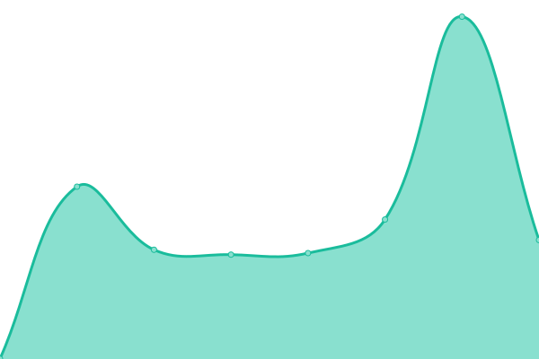

# [📈 Scriptbased.cloud Live Status](https://live-status.scriptbased.cloud): <!--live status--> **🟧 Partial outage**

We use [Issues](https://github.com/patrickc-sb/uptime-status/issues) as incident reports, [Actions](https://github.com/patrickc-sb/uptime-status/actions) as uptime monitors, and GitHub Pages for the status page.

<!--start: status pages-->
<!-- This summary is generated by Upptime (https://github.com/upptime/upptime) -->
<!-- Do not edit this manually, your changes will be overwritten -->
<!-- prettier-ignore -->
| URL | Status | History | Response Time | Uptime |
| --- | ------ | ------- | ------------- | ------ |
|  [app-srv01](116.203.202.135) | 🟥 Down | [app-srv01.yml](https://github.com/patrickc-sb/scriptbased.cloud-status/commits/HEAD/history/app-srv01.yml) | 

 0ms
     
 | 

<a href="https://live-status.scriptbased.cloud/history/app-srv01">1.04%</a>
    

|  [proxy01](https://proxy01.scriptbased.cloud) | 🟩 Up | [proxy01.yml](https://github.com/patrickc-sb/scriptbased.cloud-status/commits/HEAD/history/proxy01.yml) | 

 480ms
     
 | 

<a href="https://live-status.scriptbased.cloud/history/proxy01">100.00%</a>
    

|  Faunt N8N | 🟩 Up | [faunt-n8-n.yml](https://github.com/patrickc-sb/scriptbased.cloud-status/commits/HEAD/history/faunt-n8-n.yml) | 

 474ms
     
 | 

<a href="https://live-status.scriptbased.cloud/history/faunt-n8-n">100.00%</a>
    

<!--end: status pages-->

[**Visit status website →**](https://live-status.scriptbased.cloud)

## 📄 License

- Powered by: [Upptime](https://github.com/upptime/upptime)
- Code: [MIT](./LICENSE) © [Upptime](https://upptime.js.org)
- Data in the `./history` directory: [Open Database License](https://opendatacommons.org/licenses/odbl/1-0/)
